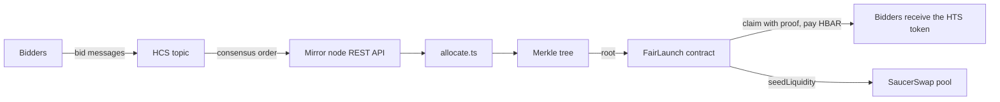

# Fair Order

**Replace gas-price competition with Hedera consensus ordering.**

Fair Order is a scaffold-hbar template for a token sale where allocation follows HCS consensus order rather than transaction gas price. Anyone can recompute the result from the public mirror node.

When the claim window closes, the raised HBAR and the unclaimed tokens create a SaucerSwap pool.

## Architecture



The allocation rule runs off-chain on public data. The contract only checks a Merkle proof, so anyone can recompute the root and compare it with the published one.

## How it works

1. **Bid.** Bidders send `{"v":1,"units":"<amount>"}` to an HCS topic. The bidder is the message payer, so a bid cannot be attributed to an account that did not pay for it.
2. **Settle.** `launch:settle` reads the topic from the mirror node in consensus order and allocates first-come-first-served, up to a per-wallet cap and the total supply. It writes a Merkle tree of the allocations.
3. **Publish.** The owner publishes the Merkle root to the `FairLaunch` contract. Anyone can run `launch:verify` to recompute it.
4. **Claim.** Each bidder calls `claim(amount, proof)` and pays `amount * tinybarPerUnit` in HBAR to receive the HTS token.
5. **Seed.** After the deadline the owner calls `seedLiquidity`. The contract creates a new SaucerSwap HBAR/token pool with the raised HBAR and the same value of tokens, at the sale price. `sweep` returns anything left.

Services used: HCS (ordering), HTS (sale token), smart contracts (claims), SaucerSwap (liquidity).

## Verify the result yourself

Once the root is published, recompute it from the topic and compare:

```bash
npm run launch:verify -w packages/hardhat -- --network hederaTestnet
```

It reads the bid topic from the mirror node, runs the same allocation rule, and compares the Merkle root with the one on-chain. On the testnet run below, two separate runs printed the same root both times:

```
Recomputed from topic: 0x3e8db610c81ea6e5c1d5b86345c6f95056d0822b49a594f7726eec7e6724542b
Published on-chain:    0x3e8db610c81ea6e5c1d5b86345c6f95056d0822b49a594f7726eec7e6724542b
MATCH: the published root is reproducible from the HCS log.
```

`launch:verify` needs `SALE_SUPPLY_UNITS` and `WALLET_CAP_UNITS` to match the values used at settlement.

## Prerequisites

- Node.js 20.18.3 or later
- A Hedera testnet account with an ECDSA key, from the [Hedera Portal](https://portal.hedera.com), funded from the faucet. Claiming 5 tokens costs 5 HBAR, and SaucerSwap charges a pool creation fee of about $2 in HBAR (roughly 19 HBAR at the time of writing). Fund the account with at least 50 HBAR.

## Quick start

```bash
npm create scaffold-hbar@latest -- --template abdoulxw3/Fair-order
cd <project>
cp packages/hardhat/.env.example packages/hardhat/.env
```

Set `HEDERA_ACCOUNT_ID`, `DEPLOYER_PRIVATE_KEY` and `ROUTER_ADDRESS` in `packages/hardhat/.env` (see the table below), then run:

```bash
npm run hardhat:test
npm run launch:quote -w packages/hardhat -- --network hederaTestnet
npm run launch:create -w packages/hardhat
```

`launch:quote` prints the current pool creation fee and your balance. `launch:create` prints `TOKEN_EVM_ADDRESS` and `TOPIC_ID`. Add both to `.env`, then deploy:

```bash
npm run hardhat:deploy -- --network hederaTestnet
```

Deploy prints `LAUNCH_ADDRESS`. Add it to `.env`, then run the sale. The claim window defaults to 24 hours. For a quick run, set `CLAIM_WINDOW_SECONDS=180` as shown:

```bash
npm run launch:bid -w packages/hardhat -- 500000000
npm run launch:settle -w packages/hardhat
CLAIM_WINDOW_SECONDS=180 npm run launch:publish -w packages/hardhat -- --network hederaTestnet
npm run launch:verify -w packages/hardhat -- --network hederaTestnet
npm run launch:claim -w packages/hardhat -- --network hederaTestnet
```

The bid above is 5 tokens (the token has 8 decimals). Settle reads the mirror node, so wait about 10 seconds after bidding. When the claim window has closed, seed the pool:

```bash
npm run launch:seed -w packages/hardhat -- --network hederaTestnet
```

To use the UI, create `packages/nextjs/.env.local`:

```
NEXT_PUBLIC_LAUNCH_ADDRESS=<LAUNCH_ADDRESS>
NEXT_PUBLIC_TOPIC_ID=<TOPIC_ID>
```

Then run `npm run next:start`. The page has a queue simulator that compares consensus ordering with highest-gas ordering, and a live bid log read from the mirror node. Connect a wallet on Hedera Testnet (chain ID 296, RPC `https://testnet.hashio.io/api`) to claim an allocation once `allocations.json` exists. Any bidder other than the deployer must associate the sale token with their account before claiming.

## Tests

```bash
npm run hardhat:test
```

The suite has 39 tests:

- **Allocation rule:** empty and zero-supply cases, zero-unit bids, exact fills, a cap larger than the supply, amounts beyond JavaScript number range, and five properties checked over 500 seeded random bid lists (never over-allocates, never exceeds the cap or the ask, serves each wallet once, only shortchanges when supply runs out, deterministic and in bid order).
- **Merkle tree:** the same bids always give the same root, every entry's proof verifies, and the root changes when an amount or the bid order changes.
- **Contract:** claims with the exact price, wrong payment, wrong amount, another account's proof, a tampered proof, double claims, the claim deadline, owner-only publish, seed and sweep, balance reconciliation when everything is claimed, liquidity seeding and sweeping.

## Environment variables

Set these in `packages/hardhat/.env`.

| Variable | Purpose |
| --- | --- |
| `HEDERA_ACCOUNT_ID` | Testnet account ID, for example `0.0.1234` |
| `DEPLOYER_PRIVATE_KEY` | Hex ECDSA private key of that account |
| `SALE_SUPPLY_UNITS` | Total supply in smallest units |
| `WALLET_CAP_UNITS` | Maximum allocation per account |
| `TINYBAR_PER_UNIT` | Price in tinybars per smallest token unit |
| `CLAIM_WINDOW_SECONDS` | Claim window length after publishing (default 86400) |
| `TOKEN_EVM_ADDRESS` | Printed by `launch:create` |
| `TOPIC_ID` | Printed by `launch:create` |
| `ROUTER_ADDRESS` | SaucerSwap V1 router. On testnet use `0x0000000000000000000000000000000000004b40` (contract `0.0.19264`) |
| `LAUNCH_ADDRESS` | Printed by deploy |

Never commit `.env`. It is already in `.gitignore`.

## Scripts

| Command | What it does |
| --- | --- |
| `npm run hardhat:test` | Contract, allocation and Merkle tests |
| `npm run lint` | Compiles the contracts and type-checks both packages |
| `npm run launch:quote -w packages/hardhat -- --network hederaTestnet` | Prints the SaucerSwap pool creation fee and your balance |
| `npm run launch:create -w packages/hardhat` | Creates the HTS token and the HCS topic |
| `npm run hardhat:deploy -- --network hederaTestnet` | Deploys `FairLaunch` and funds it with the supply |
| `npm run launch:bid -w packages/hardhat -- <units>` | Posts a bid to the topic |
| `npm run launch:settle -w packages/hardhat` | Builds allocations and the Merkle tree from the topic |
| `npm run launch:publish -w packages/hardhat -- --network hederaTestnet` | Publishes the root and opens the claim window |
| `npm run launch:verify -w packages/hardhat -- --network hederaTestnet` | Recomputes the root from the topic and compares it with the published one |
| `npm run launch:claim -w packages/hardhat -- --network hederaTestnet` | Claims the signer's allocation |
| `npm run launch:seed -w packages/hardhat -- --network hederaTestnet` | Creates the SaucerSwap pool from the raised HBAR |
| `npm run next:start` | Runs the frontend |
| `npm run next:build` | Builds the frontend |

## Layout

```
packages/hardhat/contracts/FairLaunch.sol   claims and liquidity seeding
packages/hardhat/scripts/lib/allocate.ts    allocation rule
packages/hardhat/scripts/lib/merkle.ts      Merkle tree and proofs
packages/hardhat/scripts/lib/snapshot.ts    topic to allocations to root
packages/hardhat/scripts/lib/mirror.ts      reads bids from the mirror node
packages/hardhat/scripts/lib/fee.ts         reads the SaucerSwap pool creation fee
packages/hardhat/scripts/                   create, deploy, bid, settle, publish, verify, claim, seed
packages/hardhat/test/                      allocation, Merkle and contract tests
packages/nextjs/app/                        simulator, bid log and claim UI
```

## Adapting it

- Change the rule in `allocate.ts`. Any deterministic function of the ordered bids works, because anyone can recompute the published root and compare.
- Claims are paid in HBAR. To sell for another HTS token, replace the `msg.value` check in `claim` with a `transferFrom`.
- The sale price sets the opening pool price, because `seed.ts` pairs the raised HBAR with the same value of tokens. Change the amounts in `seed.ts` to open at a different price.

## Testnet run

The full flow (bid, settle, publish, claim, seed) was run on Hedera testnet:

- [Claim transaction](https://hashscan.io/testnet/transaction/0x01f3148b3a379cf044bad80dd9a45b17d49189eb6b99810fcac183f272b90e5a)
- [Pool seeding transaction (SaucerSwap)](https://hashscan.io/testnet/transaction/0xd93873133c58f66c824f1443eaa7db274d0ea5eaedb2ddcdf7b5622e4354015c)
- [FairLaunch contract](https://hashscan.io/testnet/contract/0x90e555199320471f9543f9ce80E53FA4460d3f1E)
- [Sale token](https://hashscan.io/testnet/token/0.0.10823627)
- [HCS bid topic](https://hashscan.io/testnet/topic/0.0.10823628)

## Limits

- Allocation order is the consensus timestamp the network assigns to each bid. The template does not defend against one person bidding from several accounts, because the wallet cap applies per account.
- The owner chooses the claim window and publishes the root. Trust in the result comes from anyone being able to recompute it from the topic, not from the contract verifying HCS.
- The supply and the wallet cap feed the allocation but are not stored on-chain, so a verifier needs the owner to disclose them.
- `seedLiquidity` calls `addLiquidityETHNewPool`, so it only works for a token that has no SaucerSwap pool yet. The owner pays the pool creation fee, and the script adds a 5% margin to it. Any surplus joins the pool.
- LP tokens go to the owner. `seed.ts` sets the owner's account to unlimited automatic token associations so it can receive them.
- Inside the Hedera EVM, `msg.value` is in tinybars. The frontend, `claim.ts` and `seed.ts` convert to the weibar units that JSON-RPC expects.
- Nothing here is audited. The contract is a reference for the pattern, not production-ready sale infrastructure.

MIT licensed.
