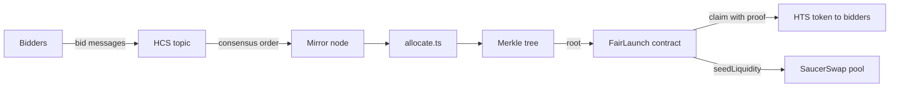

# Fair Order

A scaffold-hbar template for a token sale where the order of bids comes from HCS consensus timestamps, and anyone can recompute who got what from the public record.

## Why

A sale needs an order, and someone has to decide who gets in before the supply runs out. If the owner builds that list privately, you have to take their word for it. Here the bids are messages on a public HCS topic, each with a consensus timestamp. The allocation is a plain function of that log, so anyone can run it again and compare the result with what the owner published. Money doesn't buy a place in the queue, because every bid costs the same small fixed fee.

## How it works

1. Bidders send a message like `{"v":1,"units":"500000000"}` to an HCS topic. The bidder is whoever paid for the message. A bid costs the standard HCS message fee, a fraction of a cent and the same for everyone, so paying more doesn't move you up.
2. `launch:settle` reads the topic from the mirror node in order and hands out tokens first come, first served, up to a per-wallet cap and the total supply. It writes the allocations as a Merkle tree.
3. The owner publishes the Merkle root to the contract.
4. Each bidder claims with a proof and pays HBAR (`amount * tinybarPerUnit`) to get the HTS token.
5. After the claim window closes, `launch:seed` creates a SaucerSwap pool with the raised HBAR and the same value in tokens, so the pool opens at the sale price.



The allocation runs off-chain on public data. The contract only checks the proof.

## Run it

You need Node 20.18.3 or later and a funded Hedera testnet account with an ECDSA key (get one at [portal.hedera.com](https://portal.hedera.com)). Keep about 50 HBAR on it: a 5 token claim costs 5 HBAR and SaucerSwap charges roughly 19 HBAR to create a pool.

```bash
npm create scaffold-hbar@latest -- --template abdoulxw3/Fair-order
cd <project>
cp packages/hardhat/.env.example packages/hardhat/.env
```

Fill in `HEDERA_ACCOUNT_ID`, `DEPLOYER_PRIVATE_KEY` and `ROUTER_ADDRESS` in `packages/hardhat/.env`, then:

```bash
npm run hardhat:test
npm run launch:create -w packages/hardhat
```

`launch:create` prints `TOKEN_EVM_ADDRESS` and `TOPIC_ID`. Put both in `.env`, then deploy:

```bash
npm run hardhat:deploy -- --network hederaTestnet
```

That prints `LAUNCH_ADDRESS`. Put it in `.env` too, then run a sale. The claim window is 24 hours by default, and `CLAIM_WINDOW_SECONDS=180` below makes it short enough to test:

```bash
npm run launch:bid -w packages/hardhat -- 500000000
npm run launch:settle -w packages/hardhat
CLAIM_WINDOW_SECONDS=180 npm run launch:publish -w packages/hardhat -- --network hederaTestnet
npm run launch:verify -w packages/hardhat -- --network hederaTestnet
npm run launch:claim -w packages/hardhat -- --network hederaTestnet
```

500000000 units is 5 tokens (8 decimals). Wait about 10 seconds after bidding so the mirror node has the message. When the window has closed:

```bash
npm run launch:seed -w packages/hardhat -- --network hederaTestnet
```

`npm run launch:quote -w packages/hardhat -- --network hederaTestnet` prints the current pool creation fee and your balance if you want to check before seeding.

For the frontend, put `NEXT_PUBLIC_LAUNCH_ADDRESS` and `NEXT_PUBLIC_TOPIC_ID` in `packages/nextjs/.env.local` and run `npm run next:start`. It has a small simulator that orders the same bids by consensus time or by gas, a live bid log from the mirror node, and a claim button that appears once `allocations.json` exists. The "Highest gas" mode models chains where fees buy position. Hedera doesn't work that way. It's there so you can see what consensus ordering changes. A bidder who isn't the deployer has to associate the token with their account before claiming.

| Variable | What it is |
| --- | --- |
| `HEDERA_ACCOUNT_ID` | Your testnet account, like `0.0.1234` |
| `DEPLOYER_PRIVATE_KEY` | Hex ECDSA key for that account. Never commit `.env` |
| `SALE_SUPPLY_UNITS` | Total supply in smallest units |
| `WALLET_CAP_UNITS` | Max allocation per account |
| `TINYBAR_PER_UNIT` | Price in tinybars per smallest unit |
| `CLAIM_WINDOW_SECONDS` | Claim window after publishing, default 86400 |
| `TOKEN_EVM_ADDRESS`, `TOPIC_ID`, `LAUNCH_ADDRESS` | Printed by the create and deploy steps |
| `ROUTER_ADDRESS` | SaucerSwap V1 router. On testnet: `0x0000000000000000000000000000000000004b40` (contract 0.0.19264) |

## Check the result yourself

`launch:verify` reads the topic, runs the same allocation, and compares the Merkle root with the one published on-chain. I ran it twice against the testnet sale below and got the same root both times:

```
Recomputed from topic: 0x3e8db610c81ea6e5c1d5b86345c6f95056d0822b49a594f7726eec7e6724542b
Published on-chain:    0x3e8db610c81ea6e5c1d5b86345c6f95056d0822b49a594f7726eec7e6724542b
MATCH: the published root is reproducible from the HCS log.
```

`SALE_SUPPLY_UNITS` and `WALLET_CAP_UNITS` have to match what was used at settlement.

## Tests

`npm run hardhat:test` runs 39 tests. The ones I care most about are the allocation property tests: over 500 seeded random bid lists, it never hands out more than the supply, never goes over the cap or over what someone asked for, serves each wallet once, and gives the same answer every time. The rest cover the Merkle proofs and the contract: wrong amounts, other people's proofs, double claims, the deadline, owner-only functions, and the balances adding up.

## Things that tripped me up

- SaucerSwap's `addLiquidityETH` reverts if the pool doesn't exist. A brand new token needs `addLiquidityETHNewPool`, which also charges a creation fee in HBAR. `seed.ts` reads the fee and adds 5%.
- My first seed attempt reverted at 4M gas. 8M works, and `seed.ts` runs a `staticCall` first so a real revert shows its reason.
- Inside the EVM `msg.value` is in tinybars, but wallets and JSON-RPC use weibar. `claim.ts`, `seed.ts` and the frontend convert.
- The pool's LP token goes to the owner, so that account needs an open auto-association slot. `seed.ts` sets it to unlimited.

## What it doesn't do

- Money can't buy a place in the queue, but speed and account count still matter. A bot that submits the moment the sale opens will beat a person, and one person can bid from many accounts because the cap is per account. Pro-rata allocation over a bidding window would remove the speed race. I haven't built it.
- The owner publishes the root. You trust it because you can recompute it, not because the contract checks HCS.
- The supply and cap aren't stored on-chain, so a verifier has to get them from the owner.
- `launch:seed` only works for a token with no SaucerSwap pool yet.
- Not audited. Treat it as a reference for the pattern.

## Testnet run

- [Claim transaction](https://hashscan.io/testnet/transaction/0x01f3148b3a379cf044bad80dd9a45b17d49189eb6b99810fcac183f272b90e5a)
- [Pool seeding transaction](https://hashscan.io/testnet/transaction/0xd93873133c58f66c824f1443eaa7db274d0ea5eaedb2ddcdf7b5622e4354015c)
- [FairLaunch contract](https://hashscan.io/testnet/contract/0x90e555199320471f9543f9ce80E53FA4460d3f1E)
- [Sale token](https://hashscan.io/testnet/token/0.0.10823627)
- [HCS bid topic](https://hashscan.io/testnet/topic/0.0.10823628)

MIT licensed.
